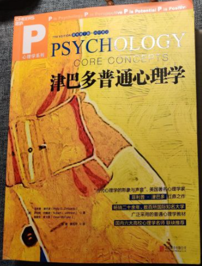
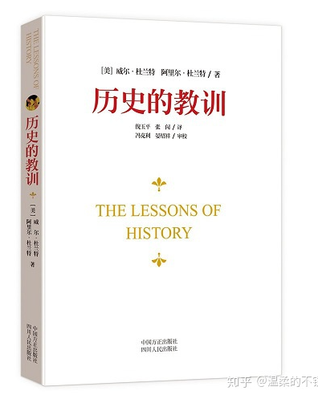

# 书单

收集一些别人觉得好的书，所有评价都是别人说的。

## 《津巴多普通心理学》

可以毫不夸张的说，如果你能坚持啃完这本大部头，你对这个世界的认知将会上升到一个崭新的层次。

---

## 《精神现象学》——黑格尔

主要内容是从感性这个最基础的东西出发，上升到知性知觉，再上升到自我意识，再上升到理性，最后上升到精神和宗教。上升发展的过程就是所谓的辩证法。中间涉及了很多黑格尔之前的思想流派，甚至也预见了很多之后的现代思想。比如自我意识这一章就包括了对马克思启发很大的主奴意识，还有斯多亚主义，怀疑论，对上帝的哀怨意识；理性这一章涉及了形式逻辑，心理学，面相学，现代人关心的自我实现（其中包括享乐主义，理想主义，利己主义，自大狂），解释学，主体间性，还有康德的实践理性；精神这一章包括伦理，法权，启蒙与教化，道德。大概能感受到内容有多丰富了吧。

语言极度浓缩，别的哲学家写一本书要说的东西他几页就给概括完了。

---

## TCP/IP详解 卷1 : 协议（英文版）

翻译真的跟屎一样，平均一页最少有三四个翻译错误，白白糟蹋了这本经典之作。学习影印的英文版吧，真的比中文版好读多了。

---

## 数据库索引设计与优化

很适合提升基本功

---

## 资本主义、社会主义与民主

作者: (美)约瑟夫·熊彼特

关于马克思的分析，深得我心

---

## 美国大城市的死与生（纪念版）

作者:  [美] 简·雅各布斯

自1961年出版以来，这本书即成为城市研究和城市规划领域的经典名作，对当时美国有关都市复兴和城市未来的争论产生了持久而深刻的影响。

---

## 《设计规则：模块化的力量》

作者:  [美] 鲍德温

无论是你投资，创业，还是写一篇文章，模块化思想都能帮上你。

这本书谈的是机制设计，机制设计，其实就是系统运行规则的制定，是一个复杂系统的构建。无论是创业做一个公司，开发一个产品，还是创作一篇文章，都是在构建一个复杂系统。

---

## 历史的教训

作者： 杜兰特教授夫妇

不算很冷门，但是含金量极高，堪称是一部浓缩的历史智慧书。这本薄薄的书其实是从作者的11卷巨著《文明的故事》里摘录出来的精华

---

## 传销实战指南

这本书，有很多对人性理解和心理学运用与掌握技巧，（这不比那些自媒体，公众号强，干活多）理解的透彻的化，对生活很有启发性的，里边有些理论可以适当运用生活当中，（还是那句话 错在于人而不在于刀）

---

## 《性学入门》

作者： 李银河

作者李银河，是美国匹兹堡大学社会学博士，中国社会科学院社会学所研究员、教授，一直致力于研究家庭婚姻、性别与性领域，曾被《亚洲周刊》评为“中国最具影响力的五十人”之一。

这本书就她性学研究的集大成之作。

---

## 《变量3》

作者： 何帆

三年前他发愿，要用30年的时间，每年写一本书，来记录中国2019-2049年的变化，本书即是第三部。

---

## 《破茧》

作者： 施展

任何一个想要理解当今世界和构想未来秩序的人，都不应错过此书。

---

## 《第一性原理》

作者： 李善友

李善友教授为创业者、企业家深度解析第一性原理这个万事万物的根本性命题，这本书不仅是混沌大学的创新必读书，更是凝聚了李善友教授的创新课堂的知识精华，更加清晰明了地展现了李善友教授所传递的创新思想，也刷新了我对哲学的认知。

---

## 《娱乐至死》

作者： 尼尔·波兹曼（Neil Postman，1931-2003）

解析了美国社会由印刷统治转变为电视统治，印刷术时代步入没落，而电视时代蒸蒸日上；电视改变了公众话语的内容和意义；政治、宗教、教育和任何其他公共事务领域的内容，都不可避免的被电视的表达方式重新定义，一切公共话语都在以娱乐的方式出现，我们的文化正面临着危机，向着浅薄无知堕落。

---

## 《霍乱时期的爱情》

作者： 加夫列尔·加西亚·马尔克斯（Gabriel José de la Concordia García Márquez，1927年3月6日－2014年4月17日）

该小说讲述了一段跨越半个多世纪百年的爱情故事：男女主人公在二十岁的时候没能结婚，因为他们太年轻了；经过各种人生曲折之后，到了八十岁，他们还是没能结婚，因为他们太老了。在五十年的时间跨度中，作者展示了所有爱情的可能性，所有的爱情方式。幸福的爱情，贫穷的爱情，高尚的爱情，庸俗的爱情，粗暴的爱情，柏拉图式的爱情，放荡的爱情，羞怯的爱情……

---

## 《社会性动物》

作者： 埃利奥特·阿伦森 Elliot Aronson当代最杰出的社会心理学家，美国艺术与科学学院院士

讲述人际关系的心理学著作，涉及情感、移情、偏见、攻击性、从众性和利他行为等诸多方面。

---

## 《非暴力沟通》

作者： 马歇尔·卢森堡，生于1934年，国际非暴力沟通中心创始人，全球首位非暴力沟通专家

为一个遵纪守法的好人，也许我们从来没有想过和“暴力”扯上关系。不过如果稍微留意一下现实生活中的谈话方式，并且用心体会各种谈话方式给我们的不同感受，我们一定会发现，有些话的确伤人！言语上的指责、嘲讽、否定、说教以及任意打断、拒不回应、随意出口的评价和结论给我们带来的情感和精神上的创伤，甚至比肉体的伤害更加令人痛苦。这些无心或有意的语言暴力让人与人变得冷漠、隔阂、敌视

---

## 《算法导论》

---

## 《影响力》

---

## 《专业主义》

